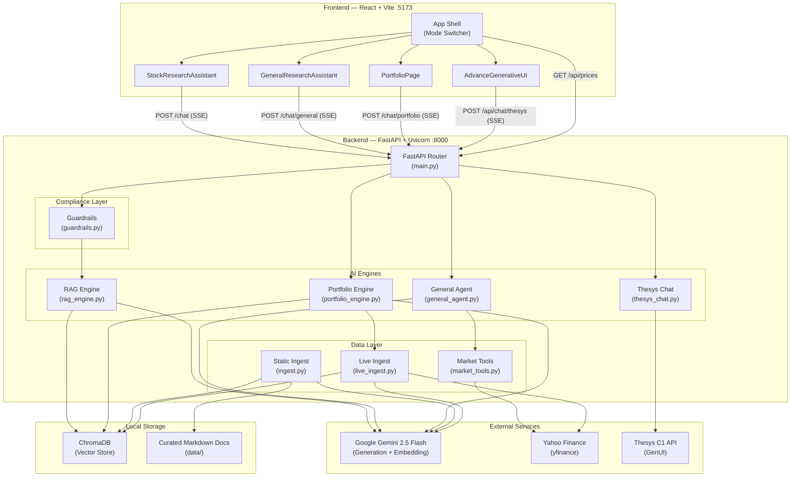
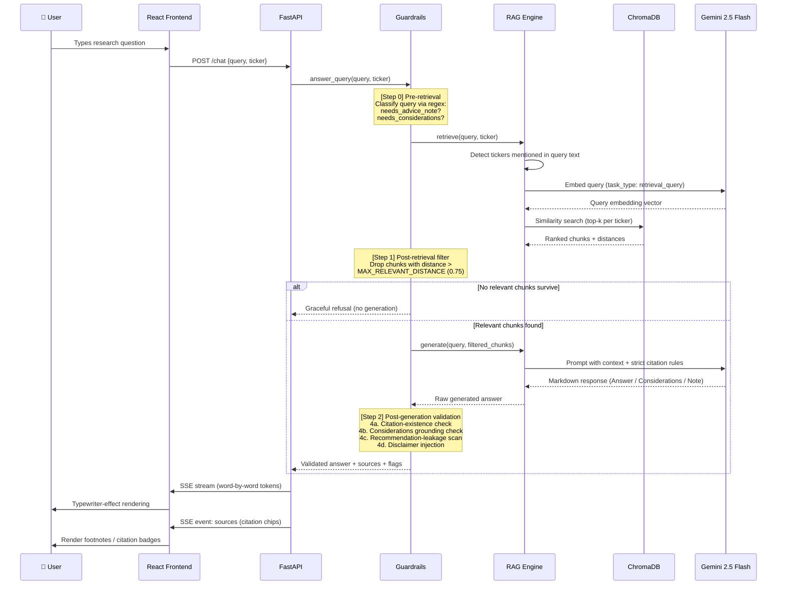
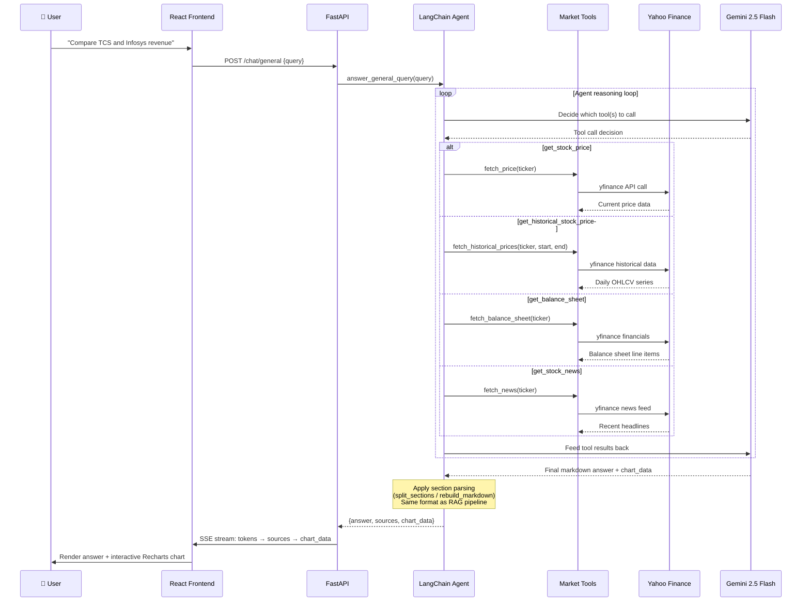
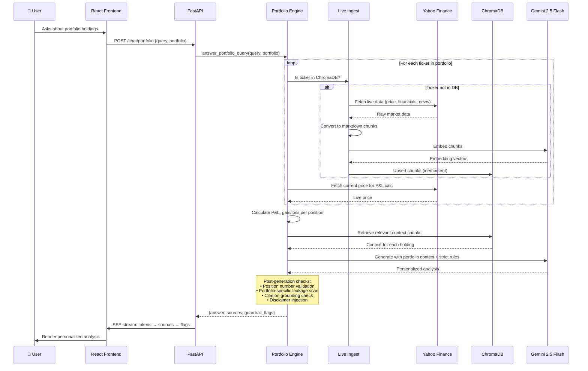
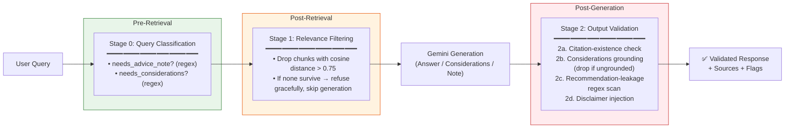

# Logix LLM  🚀

Logix LLM is a **SEBI-compliant, highly constrained AI research assistant** built for the Indian financial sector. It securely analyzes live market data and user portfolios to provide strictly grounded, verifiable research with exact citations — **without giving illegal or unauthorized financial advice**.

> **Why "highly constrained"?** Every AI-generated response passes through a multi-stage guardrail pipeline that validates citations against retrieved context, strips ungrounded speculation, intercepts recommendation-leakage via regex and logical checks, and deterministically injects SEBI-compliant disclaimers — before a single word reaches the user.

---

## ✨ Features

| Mode | Description |
|------|-------------|
| **📈 Stock Research** | Deep, curated analytical research for 5 pre-vetted Indian stocks (TCS, HDFC, ICICI, Infosys, Reliance) backed by exact document citations from filed reports, fundamentals, and news. |
| **🔍 General Research** | An agentic AI (LangChain + Gemini) that fetches live historical data, balance sheets, and news for **any ticker worldwide** via yfinance, and dynamically streams analytical charts directly into the chat. |
| **💼 My Portfolio** | Log your trades, view live-updating P&L, and ask the AI about your holdings. Strict guardrails block the AI from providing direct "Buy/Sell" recommendations while still offering personalized, factual analysis. |
| **🧪 Advance Generative UI** | A sandbox environment utilizing the Thesys C1 SDK for advanced interactive UI component rendering (charts, cards, tables) — intentionally isolated from the main app's compliance guardrails. |

---

## 🏗️ System Architecture



---

## 🔄 Request Lifecycle — Stock Research (RAG Pipeline)

This is the core pipeline that powers the Stock Research tab. It demonstrates how a user query flows through retrieval, generation, guardrails, and streaming.



---

## 🔄 Request Lifecycle — General Research (Agentic Pipeline)

The General Research tab uses a **LangChain tool-calling agent** instead of RAG, enabling it to answer questions about any publicly traded stock worldwide.



---

## 🔄 Request Lifecycle — Portfolio Analysis

The Portfolio tab combines **live market data**, **curated RAG context**, and **user-provided position data** to deliver personalized (but never advisory) analysis.



---

## 🛡️ Guardrails Architecture

MoneyLogix implements a **4-stage compliance pipeline** to ensure no AI-generated response crosses the line from information into financial advice.



### What Each Check Catches

| Check | What It Catches | Action Taken |
|-------|----------------|--------------|
| **Query Classification** | Advice-seeking queries ("should I buy?", "is it a good investment?") | Flags for post-gen disclaimer; enables Considerations section only when appropriate |
| **Relevance Filtering** | Queries about stocks/topics not in the knowledge base | Graceful refusal instead of hallucinated answers |
| **Citation Existence** | Generated text that references sources not in retrieved chunks | Flags for observability |
| **Considerations Grounding** | Speculative "Considerations" not backed by any retrieved source | Entire section is **dropped** (not just flagged) |
| **Recommendation Leakage** | Phrases like "buy", "sell", "hold", "book profit", "good entry point", "average down" | Flagged; in portfolio mode, extended regex catches softer phrasings |
| **Disclaimer Injection** | All advice-adjacent responses | Deterministic SEBI-compliant disclaimer appended (randomly selected from variants) |

---

## 📁 Project Structure

```
Logix LLM/
├── main.py                  # FastAPI app — routes, SSE streaming, CORS, static mount
├── rag_engine.py            # Core RAG pipeline — retrieval + grounded generation
├── guardrails.py            # Compliance layer — wraps rag_engine with 4-stage validation
├── general_agent.py         # LangChain tool-calling agent for General Research mode
├── portfolio_engine.py      # Portfolio-aware engine — P&L calc + personalized analysis
├── market_tools.py          # yfinance wrappers — @tool decorated + plain fetch_* functions
├── live_ingest.py           # On-demand yfinance → ChromaDB ingestion for any ticker
├── ingest.py                # Static ingestion — curated markdown docs → ChromaDB
├── thesys_chat.py           # Thesys C1 GenUI sandbox — isolated from guardrails
├── requirements.txt         # Python dependencies
├── .env                     # API keys (GEMINI_API_KEY, THESYS_API_KEY) — gitignored
│
├── data/                    # Curated research documents (markdown)
│   ├── TCS/                 # tcs_fundamentals.md, tcs_filings.md, tcs_news.md
│   ├── HDFC/
│   ├── ICICI/
│   ├── INFOSYS/
│   └── RELIANCE/
│
├── chroma_db/               # ChromaDB persistent vector store
│
└── frontend/                # React + Vite frontend
    ├── index.html
    ├── package.json
    ├── vite.config.js       # Dev proxy: /chat, /api → localhost:8000
    ├── tailwind.config.js
    └── src/
        ├── main.jsx         # React entry point
        ├── App.jsx          # Mode switcher (Stock / General / Portfolio / GenUI)
        └── components/
            ├── StockResearchAssistant.jsx    # Curated stock research chat UI
            ├── GeneralResearchAssistant.jsx  # Agentic research chat + live charts
            ├── PortfolioPage.jsx            # Portfolio manager + P&L + chat
            └── AdvanceGenerativeUI.jsx      # Thesys C1 sandbox
```

---

## 🔧 Tech Stack

| Layer | Technology | Purpose |
|-------|-----------|---------|
| **Frontend** | React 18, Vite 5, Tailwind CSS | Reactive UI with SSE streaming, live charts (Recharts) |
| **Backend** | Python, FastAPI, Uvicorn | Async API server with Server-Sent Events (SSE) |
| **AI Generation** | Google Gemini 2.5 Flash | Reasoning, tool-calling agents, response generation |
| **AI Embeddings** | Gemini Embedding-001 | Document vectorization for semantic search |
| **Vector Database** | ChromaDB (local, persistent) | Similarity search over embedded document chunks |
| **Live Data** | Yahoo Finance (yfinance) | Real-time prices, historical OHLCV, financials, news |
| **Agentic Framework** | LangChain + LangGraph | Tool-calling agent orchestration for General Research |
| **Generative UI** | Thesys C1 SDK | Interactive UI component rendering (charts, cards, tables) |

---

## 🛠️ Local Setup & Installation

Follow these steps to get the project running on your local machine.

### 1. Clone the Repository
```bash
git clone https://github.com/Mahatva777/Logix-LLM.git
cd "Logix LLM"
```

### 2. Backend Setup (FastAPI)
The backend is built with Python and FastAPI. It requires **Python 3.10+**.

1. **Create a virtual environment:**
   ```bash
   python -m venv .venv
   ```

2. **Activate the virtual environment:**
   - On macOS/Linux:
     ```bash
     source .venv/bin/activate
     ```
   - On Windows:
     ```bash
     .venv\Scripts\activate
     ```

3. **Install backend dependencies:**
   ```bash
   pip install -r requirements.txt
   ```

4. **Set up Environment Variables:**
   Create a `.env` file in the root directory (where `main.py` is located) and add your API keys:
   ```env
   GEMINI_API_KEY="your_gemini_api_key_here"
   THESYS_API_KEY="your_thesys_api_key_here"
   ```

5. **Ingest the curated research documents** (one-time setup):
   ```bash
   python ingest.py --data-dir data --persist-dir chroma_db
   ```

6. **Start the Backend Server:**
   ```bash
   uvicorn main:app --reload --port 8000
   ```
   > The backend will now be running on `http://127.0.0.1:8000`.

### 3. Frontend Setup (React + Vite)
The frontend is built with React and Vite. It requires **Node.js 18+**.

1. **Navigate to the frontend directory** (open a **new terminal**):
   ```bash
   cd frontend
   ```

2. **Install frontend dependencies:**
   ```bash
   npm install
   ```

3. **Start the Frontend Development Server:**
   ```bash
   npm run dev
   ```
   > The frontend will start on `http://localhost:5173/`.

### 4. Running the Application
Once both servers are running:
1. Open your browser and go to **`http://localhost:5173/`**.
2. The Vite proxy in `vite.config.js` is automatically configured to route API calls (`/chat`, `/api`) to your Python backend running on port `8000`.

> **Production mode:** Run `npm run build` in `frontend/` to produce a static bundle in `frontend/dist/`. The FastAPI app automatically serves this directory, making `/chat` same-origin — no proxy or CORS needed.

---

## 🔌 API Endpoints

| Method | Endpoint | Description | Request Body |
|--------|----------|-------------|--------------|
| `POST` | `/chat` | Curated stock research (RAG + guardrails) | `{query, ticker, portfolio}` |
| `POST` | `/chat/general` | Agentic research for any ticker | `{query}` |
| `POST` | `/chat/portfolio` | Portfolio-aware personalized analysis | `{query, portfolio: [{ticker, buy_date, buy_price, quantity}]}` |
| `POST` | `/api/chat/thesys` | Thesys C1 GenUI sandbox | C1Chat SDK format |
| `POST` | `/api/ingest/ticker` | Trigger live yfinance → ChromaDB ingest | `{ticker}` |
| `GET`  | `/api/prices` | Live INR quotes for 5 curated stocks (15s cache) | — |

All streaming endpoints return **Server-Sent Events (SSE)** with event types: `token`, `sources`, `chart_data`, `guardrail_flags`, `error`.

---

## 📜 License

This project was built for hackathon/educational purposes. Please ensure compliance with applicable financial regulations (SEBI guidelines in India) before any production deployment.
